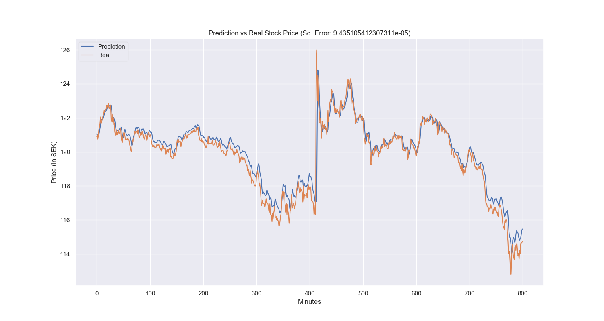

# Stock price prediction using LSTM
This mini-project contains the code for predicting stock prices using LSTM. The code expects minute-level data and can be customized to predict next `n` minutes. Keep in mind that the model performance is considerably poor for larger `n`. I have used it on `n` between 1 and 5 minutes.

The following figure shows model performance for next minute prediction `p=0` on HM data between 9th March 2020 till 3rd April 2020

## Usage

First install the required libraries as follows.

`pip3 install -r requirements.txt`

In case installation is unsucessful due to clash with any existing libraries, install the missing libraries as follows.

`pip3 install -r requirements_no_versions.txt`

Try the H\&M model using following command

`python3 hm_train_lstm_generic.py -p 0 -s HM-B.ST -n 1 -b 100 -t 60 -e 120`

where

1. `-s` stock name (here HM-B.ST). For companies abbreviations, visit Yahoo Finance. Note that script assumes that data for the stock is availabe in `data` directory
2. `-n` how many steps to predict (here only the next minute)
3. `-p` how many minutes to skip before making prediction so for predicting 3rd minute from now, we will set `p=2`
3. `-b` batch size, i.e., to be used in model training)
4. `-t` time-steps, i.e., how many minutes of previous data will considered for prediction (here last 60 min)
5. `-e` No. of epochs for trainining the model
